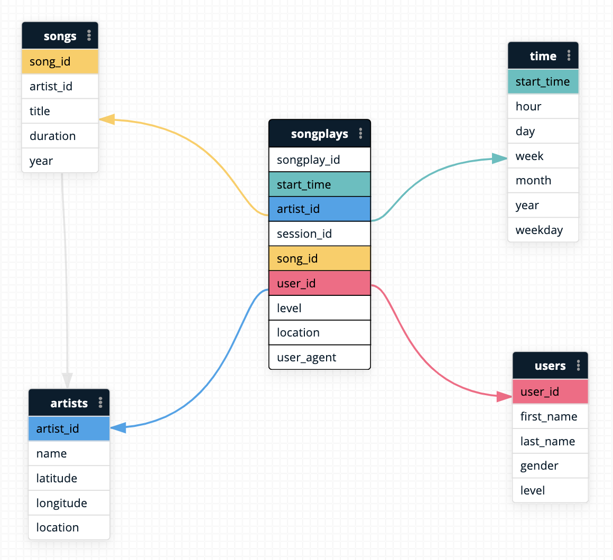

# Sparkify AWS Data Warehouse

Sparkify wants to enhance their analytical capabilities by constructing a cloud data warehouse on AWS infrastructure! This repo contains the code for:
- Data model definition for Sparkify's new data warehouse.
- ETL code to move data from S3 into Redshift data warehouse.

## Data Model

The final data model for the warehouse is a star schema model.

Facts Table: `songplays` - Logged individual plays of songs by Sparkify users (1 row per play).

Dimension Tables: 
- `users` - Details about users, such as name and gender. 
- `songs` - Details about each song, such as title and length.
- `artists` - Recording artist info - name, location
- `time` - Convenience table with conversions of timestamps into days, weekdays, etc. 



### Data Model Performance Decisions

All of these decisions assume the possibility of a much larger dataset, or that Sparkify is expect RAPID growth. Given the size of the sample dataset, it would likely be perfectly viable to use a distribution strategy of 'ALL' for every table without incurring excessive storage costs - although with this size of data it would likely be a waste of resources and needlessly complex to use a MPP columnar database like Redshift anyways. 

#### **Facts Table**
The facts table, `songplays`, is distributed by user_id, as it has a reasonably high cardinality, and is likely to be a frequent target of joins to discern usage information about users. 

Other potential distribution strategies:
- `start_time` - Likely the best option to result in an even distribution of keys, however it will almost certainly result in write skew and degraded performance, as the last 30 days are a much more likely query target than any time more than a year ago. 
- `song_id` - Another potentially viable distribution key, but the possibility of wildly popular songs may lead to heavily uneven distribution. 
- **'even' distribution** - Would create a nice, even distribution of data, but lacks any performance advantages, would likely hurt query times. 
- **'all' distribution** - We're assuming potentially rapid growth from Sparkify, meaning this is not a good idea. 

`songplays` will also use an interleaved sortkey on other potential join targets, namely `start_time`, `song_id`, and `artist_id`. This should potentially be changed to a compound sortkey once Sparkify discerns its priority order of joins based on query analysis. 


#### **Dimension Tables**
- `users` - Distributed by user_id to collocate keys with `songplays` table. Sorted by user_id. 
- `songs` - Distributed using 'all' to speed up joins, given the manageable size of the table. Sorted by song_id.
- `artists` - Distributed using 'all' to speed up joins, given the manageable size of the table. Sorted by artist_id.
- `time` - Distributed and sorted by start_time. 


\***All of these decisions should be subject to change pending query performance analysis by Sparkify post-ETL. It is impossible to perfectly predict the ways in which business needs may alter the types of queries that should be optimized for.**

## Repo Contents

- `sql_queries.py`
    * All of the queries to create warehouse staging and production tables.
- `create_tables.py`
    * Run to use queries from `sql_queries.py` to create both staging and production tables in new Sparkify warehouse. 
- `etl.py`
    * Run to first copy data into staging tables from S3, then extract relevant data into star schema as depicted above. 

## Instructions - Initializing Warehouse

1. Initialize a Redshift instance on AWS. Modify security policies to allow for open ingress, i.e. security group source = `0.0.0.0/0`.
2. Create a role that allows S3 read access, and attach that role to your Redshift instance. 
3. From this directory, copy `dwh.cfg.example` and rename to `dwh.cfg`: 
```bash
cp dwh.cfg.example dwh.cfg
```
4. Fill in `dwh.cfg` with the connection details for your redshift instance, as well as the role name for the role you attached to Redshift. 
5. Run `create_tables.py` to initialize all tables in Redshift: 
```bash
python create_tables.py
```
6. Run `etl.py` to extract data from S3 into the staging tables, then subsequently insert appropriate data from the staging tables into our production table schema as depicted above. 
