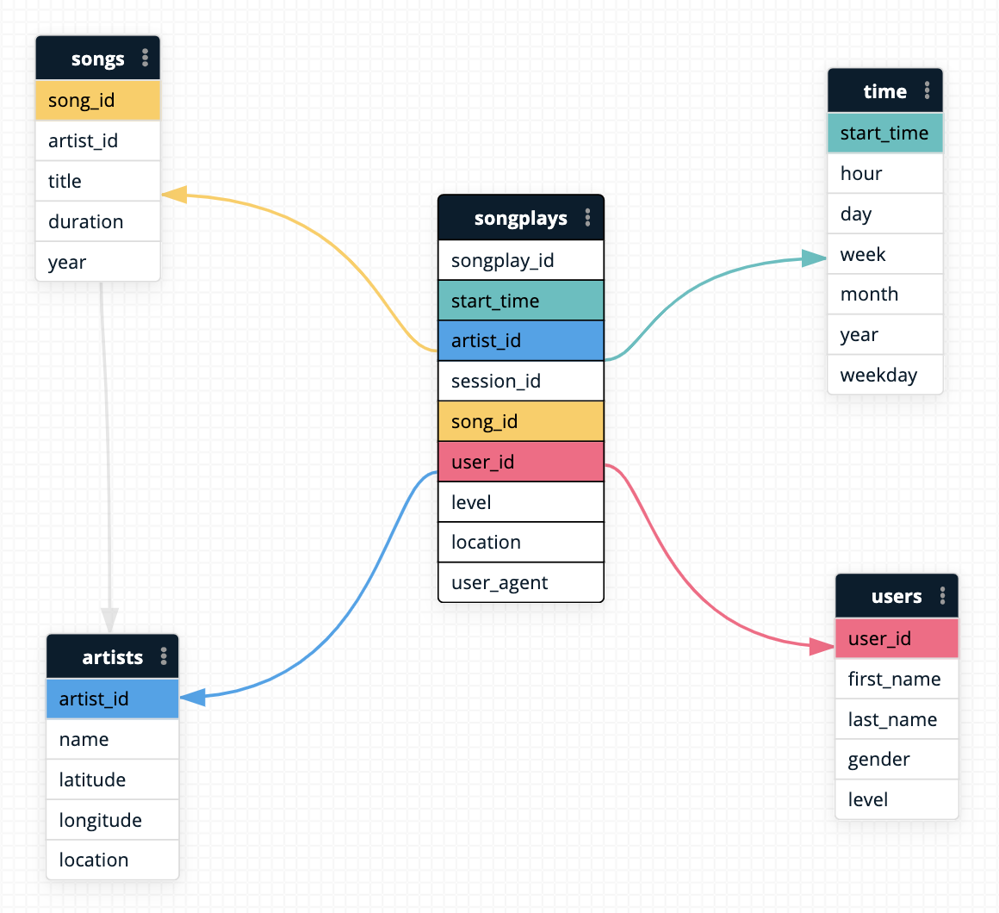

# Sparkify S3 Data Lake

Sparkify wants to set up a pipeline to load log data into an organized data lake on AWS S3! This will enable easier data access for their data science and business analytics teams. 

## Running the Pipeline
Create a new IAM Role for your AWS account for running AWS EMR jobs. Attach the **AdministratorAccess** AWS policy to grant the role admin access. Fetch your access keys for this new role according to the AWS docs instructions [here](https://docs.aws.amazon.com/general/latest/gr/aws-sec-cred-types.html). 

Load these keys into a AWS CLI profile, as described [here](https://docs.aws.amazon.com/cli/latest/userguide/cli-configure-profiles.html). 

(Optional) Generate a ssh key pair from the AWS EC2 console to enable ssh into your EMR cluster master EC2 instance. 

Clone this repository, and `cd` into the `p4-spark` project directory. 
```bash
git clone https://github.com/isaak-coursework/udacity-data-engineering.git
cd udacity-data-engineering/p4-spark
```

Copy the example `.env` file in this directory, and fill in the appropriate fields. 
```bash
cp .env.example .env
```

Example: 
```bash
MY_AWS_PROFILE_NAME=my_new_profile_name
REGION=us-east-1

SPARK_SSH_KEY=my-ssh-key-name.pem (Optional)
SUBNET_ID=subnet-12345 (Appropriate subnet from AWS account)
```

Run `run-on-emr.sh` to create an AWS EMR cluster and run `etl.py` to build Sparkify's data lake!
```bash
chmod u+x run-on-emr.sh
./run-on-emr.sh
```

Note: To test locally instead, you can run 
```bash
python etl.py --local
```
from this directory instead. 

## Data Lake Details

### Table Layout
`etl.py` builds parquet tables located at `s3://p4-spark/data`. The locations are: 
- `s3://p4-spark/data/songplays`
- `s3://p4-spark/data/songs`
- `s3://p4-spark/data/artists`
- `s3://p4-spark/data/time`
- `s3://p4-spark/data/users`

The data model looks like: 
